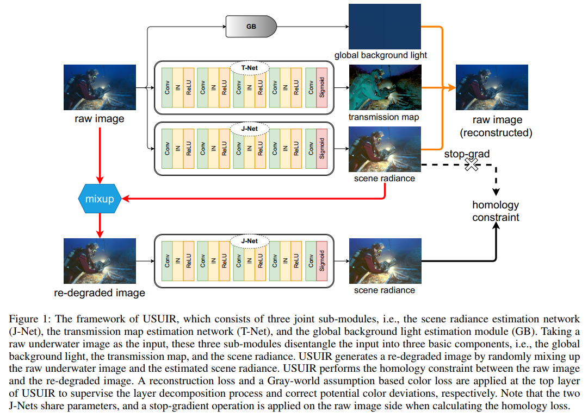

# Unsupervised Underwater Image Restoration: From a Homology Perspective (AAAI 2022)([Paper](https://www.aaai.org/AAAI22Papers/AAAI-2078.FuZ.pdf))
The Pytorch Implementation of ''Unsupervised Underwater Image Restoration: From a Homology Perspective''. 

<div align=center></div>

## Introduction
In this project, we use Ubuntu 16.04.5, Python 3.7, Pytorch 1.7.1 and one NVIDIA RTX 2080Ti GPU. 

## Running

### Testing

The pretrained models are in ./final_weight.

Check the model and image pathes in eval.py, and then run:

```
python eval.py
```

### Training

To train the model, you need to first prepare our [dataset](https://drive.google.com/file/d/1DBCXCa5GWJPB7S6xO7f0N562FqXhsV6c/view?usp=sharing).

Check the dataset path in main.py, and then run:
```
python main.py
```

## Citation

If you find USUIR is useful in your research, please cite our paper:

```
@article{Fu_Lin_Yang_Chai_Sun_Huang_Ding_2022, 
title={Unsupervised Underwater Image Restoration: From a Homology Perspective}, 
author={Fu, Zhenqi and Lin, Huangxing and Yang, Yan and Chai, Shu and Sun, Liyan and Huang, Yue and Ding, Xinghao}, 
year={2022}, 
volume={36}, 
month={Jun.}, 
pages={643-651},
url={https://ojs.aaai.org/index.php/AAAI/article/view/19944}, 
DOI={10.1609/aaai.v36i1.19944}, }
```


